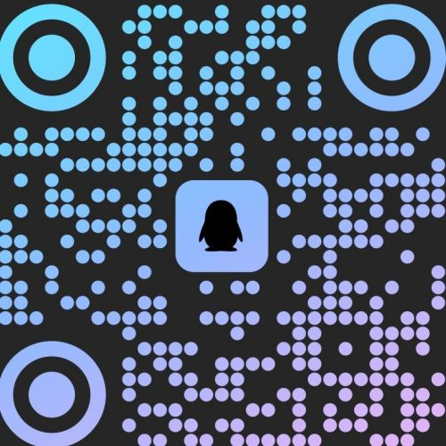
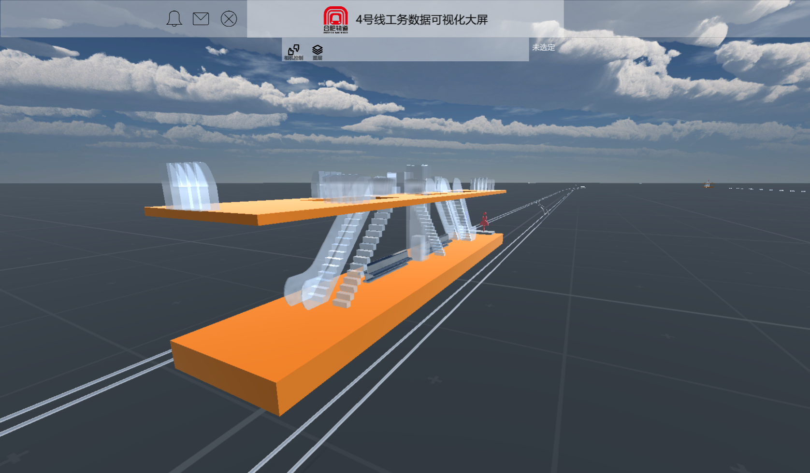

<!--
### Hi there 👋

**NewZTX/NewZTX** is a ✨ _special_ ✨ repository because its `README.md` (this file) appears on your GitHub profile.

Here are some ideas to get you started:

- 🔭 I’m currently working on ...
- 🌱 I’m currently learning ...
- 👯 I’m looking to collaborate on ...
- 🤔 I’m looking for help with ...
- 💬 Ask me about ...
- 📫 How to reach me: ...
- 😄 Pronouns: ...
- ⚡ Fun fact: ...

## 算是做了个简历吧...
-->

## 🕵️‍ 简介

嗨，你好，我是[@赛博吟游鸽子](https://newztx.github.io/)。2000年6月出生的00后

热爱代码、喜欢读书、使用第九艺术逃避现实的同时拥抱现实

希望不再只是一颗默默无闻的齿轮，而是多多少少推动社会发展实现个人价值

正在学习计算机科学，通过构建优雅的代码层次结构，实现最大化的代码复用性和可扩展性

## 🔔 联系我

| QQ                                     | 微信                                           | CSDN | Blog |
| -------------------------------------- | ---------------------------------------------- | ---- | ---- |
|  |  |      |      |

## ✊ 技术栈

打勾代表已有所了解，但不敢说精通🤓。

- 🎮unity应用程序开发
  - [X] C#(Unity MonoBehaviour API)
  - [X] unity引擎(图集、动画、URP和HDRP渲染、NavigationAI系统)
  - [ ] 插件开发(编辑器拓展、策划配置工具)
- ⚙C#工控上位机
  - [X] 《Visual C#从入门到精通》
  - [ ] WPF窗体应用程序
  - [ ] TCP/IP、UDP、MODBUS通信协议
  - [X] 数据库技术：SQL、MySql
  - [X] 《数据结构、算法与应用——C++语言描述》
- 🐍Python
  - [X] 爬虫
  - [ ] PyQt窗体开发
  - [ ] 机器学习
    - [X] Numpy、OpenCV、PIL机器视觉

## ⛳ 项目经验

### 一、工务数字孪生项目

| 右键新页面打开显示大图                 |                                                |                                                |
| -------------------------------------- | ---------------------------------------------- | ---------------------------------------------- |
| 概览                                   | 三维                                           | UGUI                                           |
|  |  |  |

- 使用[Unity引擎](https://unity.com/)完全本人**全栈**开发
- 使用[XChart](https://xcharts-team.github.io/)开源插件实现数据显示部分
- 实时显示数据库数据、或直接显示现场传感器数据、或本地excl、csv、json、xml格式数据

### 二、

## 🏢就业

- 🚇目前在 合肥市轨道交通集团>运营有限公司>线网三分公司 就职

## 📚就学

- 安徽职业技术学院>合肥铁路工程学校>城市轨道交通工程技术专业
  - 核心课程：工程制图、工程材料、工程测量、土力学与地基基础、城轨桥梁工程、地下工程、城轨轨道工程。
  - 就业方向：主要面向中国中铁、中国铁建、中国水电、市政工程公司、全国各铁路集团有限公司及地铁公司等企业，从事城市轨道交通工程的施工、管理、质量检测及工务设备养护维修等工作。

## 🧠第二大脑

- Obsidian
  使用Obsidian（本地部署的markdown文本编辑器，与Notion、思源笔记类似）管理笔记的关系和结构。

```mermaid
flowchart LR;
A[动机（驱动力，目标，毅力）];
B[行动（痛苦，心流）];
C[奖励（成果，成就感）];
A--触发-->B==结果-->C--反馈（正反馈增强，负反馈削弱）-->A;
```
