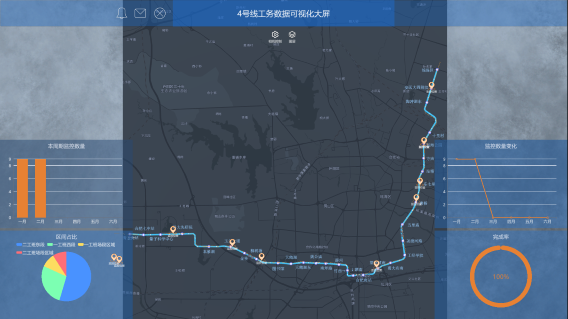
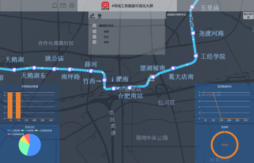
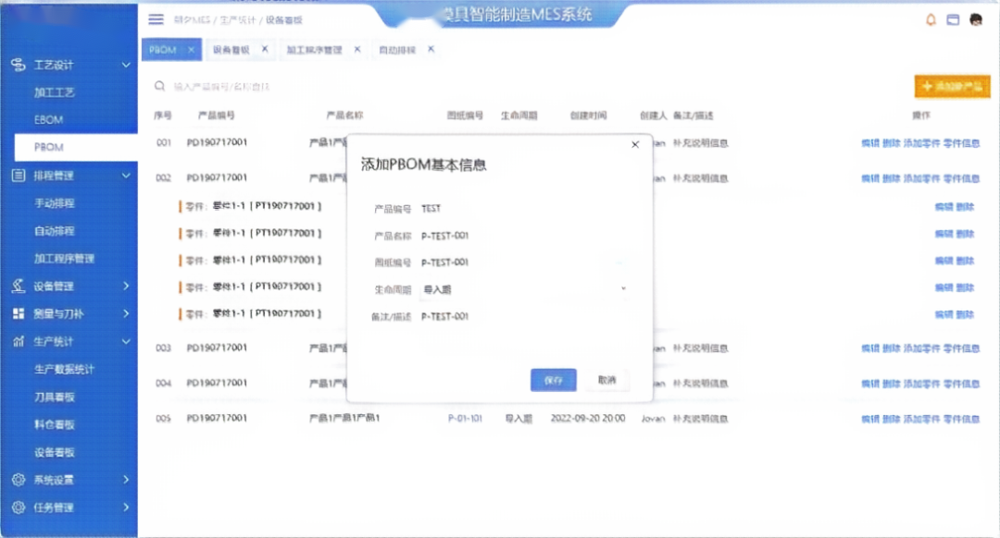
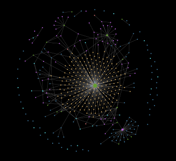
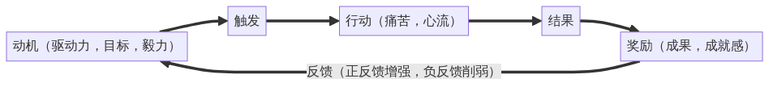

<!--
- 🔭 I’m currently working on ...糊口的工作和学习提升
- 🌱 I’m currently learning ...各种开发技术
- 👯 I’m looking to collaborate on ...反正不是白头偕老
- 🤔 I’m looking for help with ...贵人
- 💬 Ask me about ...任何事
- 📫 How to reach me: ...qq、微信、邮箱
- 😄 Pronouns: ...直男
- ⚡ Fun fact: ...
算是做了个简历吧...
-->

## 🕵️‍ 简介

嗨，你好，我是[@赛博吟游鸽子](https://newztx.github.io/)。2000年6月出生的00后

热爱代码、喜欢读书、使用第九艺术逃避现实的同时拥抱现实

希望不再只是一颗默默无闻的齿轮，而是多多少少推动社会发展实现个人价值

正在学习计算机科学，通过构建优雅的代码层次结构，实现最大化的代码复用性和可扩展性

## 🔔 联系我

| QQ                               | 微信                                     | CSDN | Blog |
| -------------------------------- | ---------------------------------------- | ---- | ---- |
|  |  |      |      |

## ✊ 技术栈

列出项目仅代表有所了解，但不敢说精通。

- 🎮unity
  - C#（C#基础、继承、多态、协程和线程）
  - unity引擎（图集、动画、URP和HDRP渲染、NavigationAI系统）
  - 插件开发(编辑器拓展、策划配置工具)
- 🔩C#工控上位机
  - C#（环境配置、debug、git）
  - WPF
  - TCP/IP、UDP、MODBUS通信协议
  - 数据库技术：SQL、MySql
  - 《数据结构、算法与应用——C++语言描述》（线性结构、树形结构、图形结构）
- 🐍Python
  - 爬虫（网页数据爬取、数据清洗、统计、分析）
  - PyQt6
  - 机器学习
  - Numpy、OpenCV、PIL机器视觉

## ⛳ 项目经验

### 一、工务数字孪生项目

| 右键新页面打开显示大图           |                                          |                                          |
| -------------------------------- | ---------------------------------------- | ---------------------------------------- |
| 概览                             | 三维                                     | UGUI                                     |
|  |  |  |

- 使用[Unity引擎](https://unity.com/)**全栈**开发，UGUI、摄像机机位控制、地图接入等
- 规范了公司部分数据的数字化归档规范，显示部分使用[XChart](https://xcharts-team.github.io/)开源插件实现
- 能够实时显示数据库数据、或直接显示现场传感器数据、或本地excl、csv、json、xml格式数据

---

### 二、C# WPF程序

| 主界面                                       |  |
| -------------------------------------------- | - |
|  |  |

- .NET Framework
- MVVM框架
- WPF自定义控件

## 🧠第二大脑

- Obsidian
  使用Obsidian（本地部署的markdown文本编辑器，与Notion、思源笔记类似）管理笔记的关系和结构。

---

## 🎯击石乃有火，不击元无烟。

